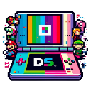

<h1 align="center">
   
  </a>
   
  <b>Citrus DS</b>
   
  <b>A fast, non-profit DS emulator.</b>
   
    
    
</h1>

  Uzuy is the ultimate Nintendo Switch emulator, originally created by the citra developers, and then continued by Phoenix.
Uzuy Remastered is the continuation to Uzuy, but also Yuzu and it is written in C#.
  This emulator aims at providing excellent accuracy and performance, a user-friendly interface and consistent builds.
  Uzuy is available on Github under the <a href="https://github.com/uzuy-emul/uzuy/blob/master/LICENSE" target="_blank"> GNU GENERAL PUBLIC LICENSE</a>.
   

